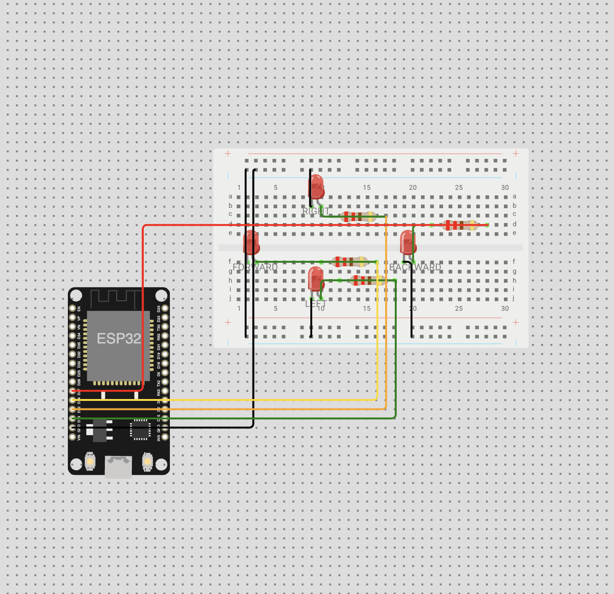
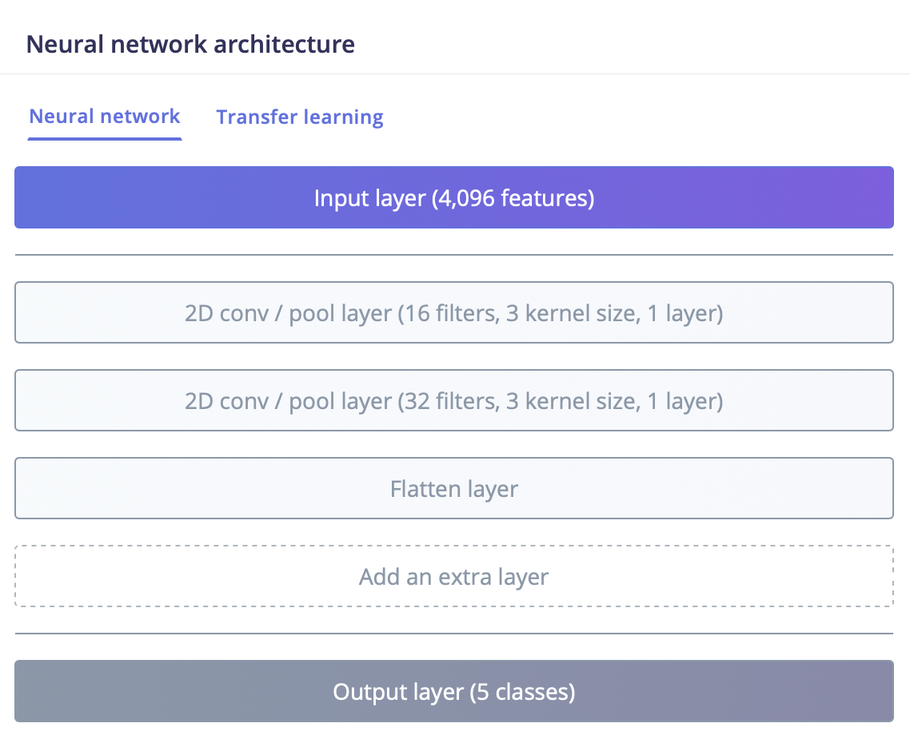
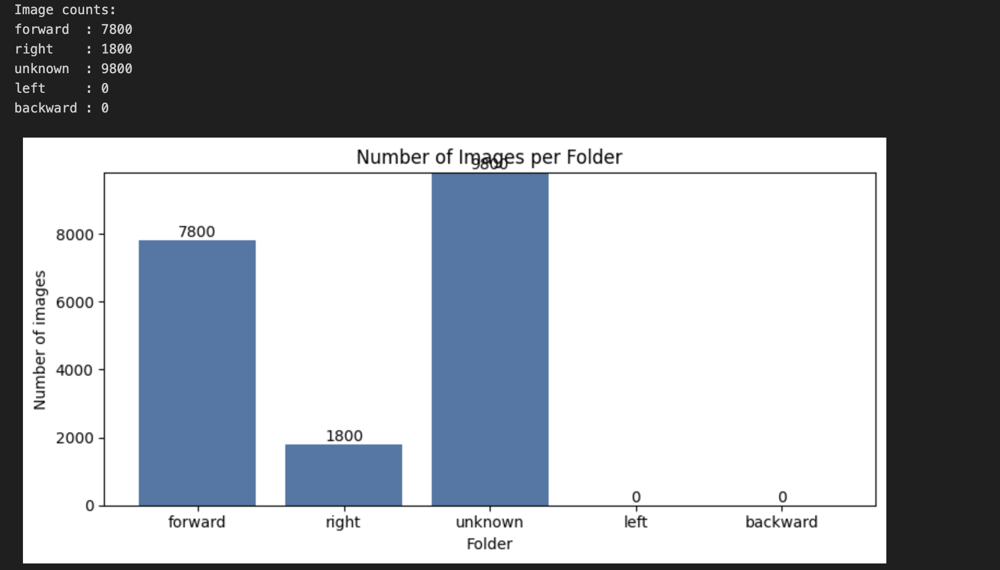
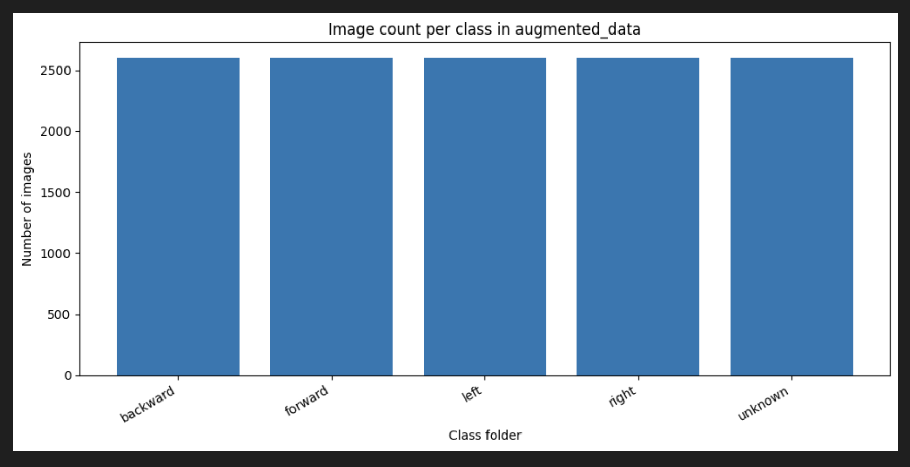

# Hand Gesture Detection 
Dectect the hand gesture (Left, Right, Up or Down) and turn on the LED using the I/O pins

# Requirements
- ## Software Requirements
    - [OpenMV IDE](https://openmv.io/pages/download?srsltid=AfmBOoqqQOKlNj1aivOZZpxfx6Zg_1ny7cqYO_99kxVEwimPfCVBPElF)
  to run the code

- ## Hardware Requirements
  - [OpenMV RT 1062](https://openmv.io/products/openmv-cam-rt?gad_source=1&gad_campaignid=23516406659&gbraid=0AAAAADOSICryFgLm1M5Oh1GLy3zOFfZN7&gclid=CjwKCAjwtcHPBhADEiwAWo3sJszJLGAS7zwRKzvMOKSZOVvNGGk_ErYrzA7MBv_XrhWebFIZ6uQqfRoCaSwQAvD_BwE)
  - [Esp 32](https://docs.espressif.com/projects/esp-dev-kits/en/latest/esp32/esp-dev-kits-en-master-esp32.pdf)
  - 4 LED Bulbs
  - Wires
  - Bread board

## Files
- `Snapshot.py`- To collec the photos
- `data_augmentation.ipynb` - Data augmentation performed on Kaggale dataset for our application ([Dataset](https://www.kaggle.com/datasets/ryanbijujoseph/hand-gesture-dataset))
- `gesture_led_wifi.py` - Runs on OpenMV RT1062 — loads TFLite model, classifies gesture from camera feed, sends result to ESP32 over WiFi UDP(User Datagram Protocol)
- `sketch_apr26a.ino` - Runs on ESP32 — receives gesture string via UDP WiFi, lights corresponding LED
- `models/mobilenet_v2_96x96_0.35.tflite` - Fine tuned Pre-trained model using MobileNet V2 in [Edge Impulse](https://www.edgeimpulse.com)
- `models/simple_model_5_class.tflite` - A simple CNN architecture build using Edge Impulse.

## Steps to Recreate
- Connect the OpenMV device to the system
- Copy the `gesture_led_wifi.py`, mobilenet_v2_96x96_0.35.tflite/simple_model_5_class.tflite, labels.txt file onto the OpenMV device
- Update the IP address of the device the Esp 32 is connected.
- Run the code

### OpenMV Setup
- Connect the OpenMV device to your system via USB
- Copy `gesture_led_wifi.py`, `trained.tflite` (or `trained_5_class.tflite`), and `labels.txt` onto the OpenMV device flash
- Update the WiFi SSID, password and ESP32 IP address in `gesture_led_wifi.py`
- Run the script via OpenMV IDE or save as `main.py` for standalone boot

### ESP32 Setup
- Open `sketch_apr26a.ino` in Arduino IDE
- Install ESP32 board package via Boards Manager (espressif/arduino-esp32)
- Update WiFi SSID and password in the sketch
- Upload to ESP32 Dev Board
- Open Serial Monitor (115200 baud) to get the ESP32 IP address
- Copy that IP into `gesture_led_wifi.py`

### Hardware Wiring (ESP32 + LEDs)
| Gesture  | ESP32 Pin | LED |
|----------|-----------|-----|
| Left     | D13       | LED 1 |
| Right    | D12       | LED 2 |
| Forward  | D14       | LED 3 |
| Backward | D27       | LED 4 |

- Each LED connected via 100Ω resistor to ESP32 GPIO pin
- All LED cathodes connected to ESP32 GND
- Both OpenMV and ESP32 must be on the same WiFi network

## Output
- Image or a short video

## Circuit Diagram

> OpenMV RT1062 captures hand gesture via camera → runs TFLite inference → 
> sends gesture label over WiFi UDP → ESP32 receives and lights the corresponding LED.

## Contribution
### Stimson
- 19 Apr
  - Added `Snapshot.py` for data collection
      - NOTES: The folder will be created on the OpenMV device under the folder 'handset_dataset'. Once all the files are created please move it to the 'dataset' folder in the repo. Make sure to use the dataset numbering as discussed in the group.
    - BUG FIX: `Snapshot.py` - updated the horizontal mirror to reflect proper direction.
- 20 Apr
    - Added Data for each class numbering from 21 to 40

### Custom model Development with Ryan
#### Architeture

#### **Model Iteration & Performance**
|Iteration| Timeline | Strategy | Train Acc. | Test Acc. | Notes |
| :--- | :--- | :--- | :--- | :--- | :--- |
| **V1 (Initial)** | 21 to 23 Apr  |Base collected data | 79.5%| 82.2% | Directional classes > 80%; "Unknown" class at 50%  |
| **V2 (Hybrid)** | 24 to 25 Apr |50% Original + 50% Augmented  | 69.0%  | 61.03%  | Attempted to reduce background bias  |
| **V3 (Final)** |26 to 27 Apr|Entire Augmented Dataset  | **96.9%**  | **94.8%**  | Achieved peak performance; noted plane background bias .(Refer to [confusion matrix of 2 diferent models](assets/simple_model_v3_acccuracy.png) |

### Ryan 
- 18 - 19 Apr    
    - Cloned the repo.
    - I had an issue with the saving the snap so I changed the snapshot code to a different one.
- 20 Apr
    - I have created my data set. 
    - The dataset is created under the `handset_dataset` folder. My sample number as discussed starts from 61-80.
- 23–24 April
  - Dataset downloaded from Kaggle (via Musab). It contained ~9 gesture classes (e.g., thumb, index).
  - Each class was manually inspected and re-labeled into directional categories: **forward, backward, left, right, unknown**.
  - 
  - To address class imbalance, data augmentation (e.g., rotation) was applied.
  - Augmentation applied across all directional classes → ~9,600 images per class.
  - Dataset shuffled; **2,500 images per class** selected → stored in `augmented data`.

- 25 April
  - Processed the **unknown** class (previously excluded from balancing).
  - Original unknown dataset: ~9,800 + 100 custom images.
  - Augmented into 3 orientations → ~29,400 images.
  - Randomly selected **2,500 images** and added custom images → final unknown class.
  - 
  - Old dataset deleted; new dataset uploaded:
    - https://www.kaggle.com/datasets/ryanbijujoseph/hand-gesture-dataset
  - `data_augmentation.ipynb` includes code (last cell) to download and save dataset automatically.
### Parikshit
- 12 APR Cloned the repo
- 20 APR 2026
    - Set up my working branch (parikshit-dataset-41-60).
- 21 Apr 2026
    - Uploaded/updated my dataset images in handset_dataset/ for my allocation 41–60 (Left / Right / Forward / Backward / Unknown) following the agreed naming convention (e.g., left_41.jpg … unknown_60.jpg).
    - Pushed the dataset with 20 images per class.
    - Added collect_photos.py (script I used to capture/collect the images for the dataset).
- 28–29 Apr 2026
    - Built the hardware circuit on breadboard:
        - Connected 4 red LEDs with 220Ω current-limiting resistors to ESP32 GPIO pins
          (D13=Left, D12=Right, D14=Forward, D27=Backward)
        - Wired common GND rail shared between all LEDs and ESP32 GND pin
        - Connected ESP32 to breadboard with jumper wires on left-side pins only
          (single-side access due to breadboard size constraints)
        - Verified circuit by running LED startup test sequence via Arduino Serial Monitor
        - OpenMV RT1062 connected separately via USB for camera feed and inference
    - Added `gesture_led_wifi.py` — full inference + WiFi UDP pipeline running on OpenMV RT1062
        - Loads TFLite model from flash
        - Runs gesture classification at ~17 FPS
        - Sends gesture label to ESP32 over UDP when confidence > 60%
        - Displays prediction and confidence on Frame Buffer
    - Added `sketch_apr26a.ino` — ESP32 UDP receiver
        - Connects to WiFi hotspot
        - Listens on UDP port 5005
        - Maps received gesture string to GPIO pin → lights LED
        - Startup LED test sequence on boot
    - Tested end-to-end pipeline: OpenMV → WiFi → ESP32 → LED

### Musab
- 20-April
    - Pulled Snapshot.py. Run on OpenMV. 
    - Forgot to remove lens cap and "took" photos initially. Was pointed out by roomate
    - Encountered corrupted photos and unable to access files on device flash
    
- 21-April
    - Added file handling to snapshot.py to fix corrupted files. 
    - Updated dataset 80-100 with 4 specified classes.
    - Added Unknown class of variables as discussed on call
    - Suggest using https://www.kaggle.com/datasets/gti-upm/leapgestrecog/data to populate classes for more data variety

### Abhishek
- 18 April 2026
  - Cloned the repo
- 20 April 2026
  - Reviewed Ryan's PR
- 21 April 2026
  - Cleared extra code from  repo and Pushed Dataset to repo
- 21 April 2026
  - Cleared extra code from  repo and Pushed Dataset to repo
- 25 April 2026
  - Created and Compared multiple CNN models and finalized mobilenet_v2 using 96x96 input dimensions using 0.35 alpha
  - Achieved 93.7% training accuracy with 500 image dataset created by the team
  - Achieved 98.8% training accuracy with retraining over augmented data set created by Ryan
